# Relatório Geral — Filtros Digitais para Processamento de Sinais Biomédicos
## Estudo comparativo de *denoising* de ECG (convencionais × avançados × inteligente)

**Disciplina:** Sinais e Sistemas (ES413) — CIn/UFPE
**Bases:** MIT-BIH Arrhythmia Database (`mitdb`) + Noise Stress Test Database (`nstdb`), PhysioNet
**Equipe:** ES413 (Manoel L.Carvalho, Emanuell Luiz, Deoclécio)

---

## 1. Objetivo

Este relatório consolida, em um único documento, todo o estudo de filtragem digital de
eletrocardiograma (ECG) realizado no projeto da disciplina ES413. O objetivo do trabalho é
**projetar, implementar e comparar objetivamente** filtros digitais para a remoção das três
classes de ruído tipicamente encontradas em registros clínicos de ECG:

- **Interferência da rede elétrica (60 Hz)** — *powerline noise* / EMI;
- **Variação da linha de base (0,05–0,5 Hz)** — *baseline wander*, de origem respiratória e de movimento;
- **Ruído muscular / aleatório (> 40 Hz)** — artefato mioelétrico (EMG) e ruído de banda larga.

O estudo está organizado em **três frentes complementares**, que cobrem as duas entregas da disciplina:

1. **Filtros convencionais (Entrega 1)** — notch IIR de 60 Hz, passa-alta IIR Butterworth de
   0,5 Hz e passa-baixa FIR de fase linear (Hamming) de 40 Hz. Implementados como biblioteca
   reutilizável em `src/` e validados sobre ECG real contaminado de forma controlada.
2. **Filtros avançados clássicos (Entrega 2)** — filtro adaptativo LMS/NLMS e *denoising*
   por Transformada Wavelet Discreta (DWT). Desenvolvidos nos notebooks (`filtros`, `sintetico`,
   `reais`, `resultados`) e analisados sobre registros reais do MIT-BIH.
3. **Técnica inteligente (Entrega 2)** — *autoencoder* convolucional de *denoising* (CNN-DAE),
   um modelo não linear único, treinado de ponta a ponta para tratar **todas** as classes de
   ruído. Implementado como subprojeto independente em `cnn-dae/` (arquitetura, pipeline de
   dados, treino e avaliação estatística). Substitui a abordagem que, na versão anterior deste
   relatório, era apenas *prevista*.

A pergunta central que o relatório responde é: **qual classe de filtro é mais adequada a cada
tipo de ruído, e por quê?** — e, no limite, **se um único modelo aprendido consegue substituir
o conjunto de filtros especializados.**

---

## 2. Fundamentação resumida

**Sinais discretos, DTFT e transformada-z.** Um sinal amostrado $x[n]$ tem espectro dado pela
DTFT, $X(e^{j\omega}) = \sum_n x[n]e^{-j\omega n}$, e é analisado no plano complexo pela
transformada-z, $X(z) = \sum_n x[n]z^{-n}$, com $z = e^{j\omega}$ sobre a circunferência
unitária. Polos e zeros de $H(z)$ determinam a estabilidade e a forma da resposta em frequência.

**Filtros IIR e FIR.** Um filtro IIR (recursivo) realimenta saídas passadas:
$$y[n] = \sum_{k=0}^{M} b_k\,x[n-k] - \sum_{k=1}^{N} a_k\,y[n-k], \qquad
H(z) = \frac{\sum_k b_k z^{-k}}{1 + \sum_k a_k z^{-k}}.$$
Um filtro FIR (não recursivo) depende apenas das entradas, $y[n] = \sum_{k=0}^{M-1} h[k]\,x[n-k]$.
Quando os coeficientes são simétricos, o FIR tem **fase linear** e atraso de grupo constante de
$(M-1)/2$ amostras — propriedade essencial para não distorcer as relações temporais entre as
ondas P, QRS e T.

**Filtros adaptativos (LMS/NLMS).** O cancelamento adaptativo de ruído estima a interferência a
partir de um sinal de referência correlacionado e a subtrai, ajustando os coeficientes a cada
amostra:
$$y[n] = \mathbf{w}^T[n-1]\,\mathbf{x}[n], \quad e[n] = d[n]-y[n], \quad
\mathbf{w}[n] = \mathbf{w}[n-1] + 2\mu\,e[n]\,\mathbf{x}[n].$$
O **NLMS** normaliza o passo pela energia da entrada,
$\mathbf{w}[n] = \mathbf{w}[n-1] + \frac{\mu}{\lVert\mathbf{x}[n]\rVert^2 + \epsilon}\,e[n]\,\mathbf{x}[n]$,
acelerando e estabilizando a convergência. A premissa fundamental é **dispor de uma referência
bem correlacionada com o ruído**.

**Transformada Wavelet Discreta (DWT).** A DWT decompõe o ECG em sub-bandas de aproximação
(baixa frequência) e detalhe (alta frequência) — análise multirresolução. O ruído é atenuado por
limiarização (*soft-thresholding*) dos coeficientes de detalhe, com limiar universal de
Donoho & Johnstone, $\lambda = \sigma\sqrt{2\ln N}$ e $\sigma = \mathrm{mediana}(|d_1|)/0{,}6745$.
A wavelet-mãe `db4` (Daubechies) é escolhida pela semelhança morfológica com o complexo QRS.
**Não exige sinal de referência externo.**

**Autoencoder convolucional de *denoising* (CNN-DAE).** Um *denoising autoencoder* é uma rede
neural treinada a reconstruir o sinal limpo $x$ a partir de uma versão corrompida $\tilde{x}$,
minimizando $\mathcal{L}(x, f_\theta(\tilde{x}))$ sobre muitos pares (ruidoso, limpo). Em sua
forma totalmente convolucional 1-D, a rede aprende **filtros locais** (kernels) em vez de
coeficientes fixos projetados à mão: um **encoder** comprime a janela de ECG por convoluções e
*pooling* (extraindo uma representação cada vez mais abstrata e de menor resolução), um
**bottleneck** concentra a informação essencial, e um **decoder** reconstrói o sinal por
*upsampling*. Diferentemente dos filtros lineares (IIR/FIR/adaptativos), o mapeamento
$f_\theta$ é **não linear** e **aprendido dos dados**, podendo modelar a estrutura morfológica
do ECG e separar ruído de sinal mesmo quando ambos ocupam a mesma faixa de frequência —
exatamente o cenário em que o passa-baixa convencional falha. Duas escolhas de projeto são
centrais: (i) **conexões residuais** ($\text{saída} = F(x) + x$), que fazem a rede aprender
apenas a *diferença* (o ruído) em vez do sinal inteiro; e (ii) a perda **MAE**, robusta a
*outliers* (batimentos ectópicos, artefatos), preferível ao MSE para sinais com picos. Como a
DWT, **não exige sinal de referência externo**; ao contrário de todos os demais, um **único
modelo** atende a todos os tipos de ruído.

---

## 3. Metodologia experimental

### 3.1 Dados

Todos os sinais vêm do PhysioNet, lidos via `wfdb` a **$f_s = 360$ Hz**:

- **ECG de referência ("limpo"):** registros do `mitdb` (100, 103, 105, 115, 215).
- **Ruído fisiológico real:** registros do `nstdb` — `bw` (*baseline wander*), `ma` (*muscle
  artifact*) e `em` (*electrode motion*).

### 3.2 Contaminação controlada e métricas

O "coração" do protocolo é gerar pares **(limpo, contaminado)** com SNR conhecido, somando ao
ECG limpo um ruído escalado para um SNR alvo:
$$x_{\text{ruidoso}} = x_{\text{limpo}} + k\,n, \qquad
k = \sqrt{\frac{P_{\text{limpo}}}{P_{n}\cdot 10^{\,\text{SNR}/10}}}.$$
Os **SNRs alvo** são **0, 6, 12 e 18 dB** (`src/noise/contaminate.py`). Como o sinal limpo é
conhecido, calculam-se métricas objetivas (`src/metrics/metrics.py`):

| Métrica | Definição | Interpretação |
|---|---|---|
| **SNR (dB)** | $10\log_{10}(P_{\text{sinal}}/P_{\text{ruído}})$ | quanto maior, melhor |
| **Δ SNR (dB)** | $\text{SNR}_{\text{saída}} - \text{SNR}_{\text{entrada}}$ | ganho real do filtro |
| **RMSE** | $\sqrt{\overline{(x_{\text{ref}}-\hat{x})^2}}$ | erro absoluto |
| **PRD (%)** | $100\sqrt{\sum(x_{\text{ref}}-\hat{x})^2 / \sum x_{\text{ref}}^2}$ | distorção relativa |
| **Correlação** | Pearson entre $x_{\text{ref}}$ e $\hat{x}$ | fidelidade morfológica |

### 3.3 Conjunto de filtros avaliados

| Filtro | Tipo | Princípio | Parâmetros |
|---|---|---|---|
| Notch 60 Hz | IIR (biquad) | rejeição de banda estreita em $f_0$ | $Q = f_0/\text{BW} = 30$, BW $\approx 2$ Hz |
| Passa-alta 0,5 Hz | IIR Butterworth | magnitude maximamente plana | 2ª ordem, `filtfilt` |
| Passa-baixa 40 Hz | FIR fase linear | janela de Hamming (lóbulo $\approx -41$ dB) | 61 *taps*, atraso $(M{-}1)/2 = 30$ amostras |
| LMS | adaptativo FIR | gradiente do erro instantâneo | $\mu = 0{,}005$–$0{,}01$; $M = 5$–$10$ |
| NLMS | adaptativo FIR | passo normalizado pela energia da entrada | $\mu = 0{,}01$–$0{,}02$; $M = 5$–$10$ |
| DWT | wavelet | `db4` + *soft-threshold* (Donoho & Johnstone) | níveis 5–9 |
| CNN-DAE | rede neural (aprendida) | encoder–bottleneck–decoder convolucional 1-D | janela 1024, ~MAE, Adam; ver Parte III |

### 3.4 Dois cuidados de protocolo (validados em dados reais)

1. **Atraso de grupo do FIR causal.** O FIR passa-baixa causal (`lfilter`) desloca o sinal em
   $(M-1)/2 = 30$ amostras; comparar a saída crua contra o `clean` dá correlação $\approx 0$ e
   SNR enganosamente ruim. **Avalia-se o FIR em fase-zero** (`filtfilt`) ou compensa-se o atraso
   antes das métricas. Filtros `filtfilt`/IIR não têm esse problema.
2. **Referência para a deriva de linha de base.** O ECG do `mitdb` já contém conteúdo < 0,5 Hz;
   ao avaliar o passa-alta contra `bw`, compara-se contra uma referência **também passa-alta**
   (`ref = apply_highpass(clean)`), senão o filtro é penalizado por remover conteúdo legítimo do
   próprio sinal limpo.

> **Nota sobre comparabilidade entre as frentes.** Os filtros convencionais (Parte I) foram
> avaliados com o protocolo de contaminação controlada acima (ruído **real** do `nstdb` em SNRs
> alvo). Os filtros avançados (Parte II) foram avaliados sobre registros reais do `mitdb`
> contaminados com ruído **sintético** específico de cada caso (senoide de 60 Hz, senoide de
> 0,2 Hz e ruído gaussiano), em janelas de 5 s, usando uma referência adequada a cada método.
> A técnica inteligente (Parte III) tem **protocolo próprio, mais amplo**: treino/teste sobre os
> **48 registros** do `mitdb` com *holdout* por registro (10 registros nunca vistos), ruído real
> (`bw`/`ma`/`em`) e sintético (`60hz`/`50hz`), em janelas de 1024 amostras (≈ 2,84 s). As
> condições das três frentes são **relacionadas, mas não idênticas**; por isso a comparação entre
> frentes é qualitativa (qual método é robusto a qual ruído), e não um confronto numérico direto
> de SNR. O único ponto de contato numérico explícito é a avaliação estatística da Parte III, que
> testa a CNN-DAE **contra a tabela de referência dos convencionais** (`comparacao_convencionais.csv`)
> via teste de Wilcoxon.

---

# Parte I — Filtros Convencionais

Validados sobre o registro 100 do `mitdb` com o protocolo de contaminação controlada
(`scripts/gerar_figuras.py`). Os números desta parte vêm de
`figures/comparacao_convencionais.csv`.

## 4.1 Notch IIR de 60 Hz

Filtro de rejeição de banda estreita ($\approx 2$ Hz) centrado em 60 Hz, com $Q = f_0/\text{BW} = 30$,
removendo a rede sem degradar o QRS. O diagrama de polos/zeros mostra os zeros sobre a
circunferência unitária no ângulo correspondente a 60 Hz e os polos imediatamente internos,
o que estreita a banda de rejeição.

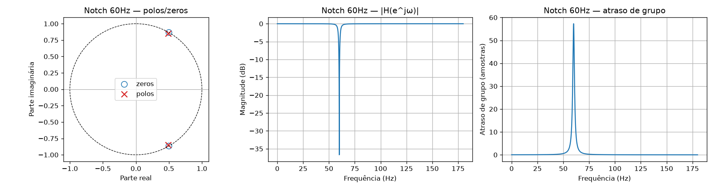

*Figura 4.1 — Formalização do notch de 60 Hz: diagrama de polos/zeros, resposta em magnitude e atraso de grupo.*

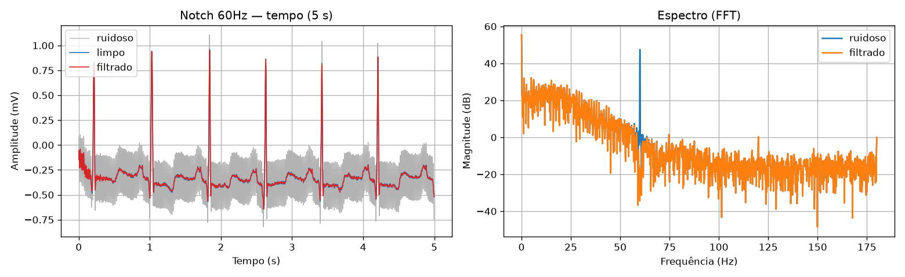

*Figura 4.2 — Efeito do notch no tempo e no espectro: o pico de 60 Hz é eliminado preservando a morfologia do QRS.*

**Resultados.** O notch leva o sinal a **≈ 34,6 dB** de SNR de saída independentemente do nível de
contaminação de entrada, com **PRD ≈ 1,87 %** e **correlação 0,999** — praticamente recuperação
perfeita do ECG.

| SNR entrada (dB) | SNR saída (dB) | Δ SNR (dB) | PRD (%) | Corr. |
|---:|---:|---:|---:|---:|
| 0 | 34,57 | +34,57 | 1,87 | 0,999 |
| 6 | 34,57 | +28,57 | 1,87 | 0,999 |
| 12 | 34,57 | +22,57 | 1,87 | 0,999 |
| 18 | 34,57 | +16,57 | 1,87 | 0,999 |

## 4.2 Passa-alta IIR Butterworth de 0,5 Hz

Corrige a variação da linha de base preservando o segmento PR e o QRS; a resposta de magnitude
maximamente plana do Butterworth evita ondulação na banda de passagem. Aplicado com `filtfilt`
(fase zero). Avaliado contra a referência passa-alta (cuidado de protocolo nº 2).

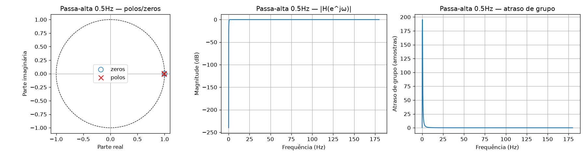

*Figura 4.3 — Formalização do passa-alta Butterworth de 0,5 Hz.*

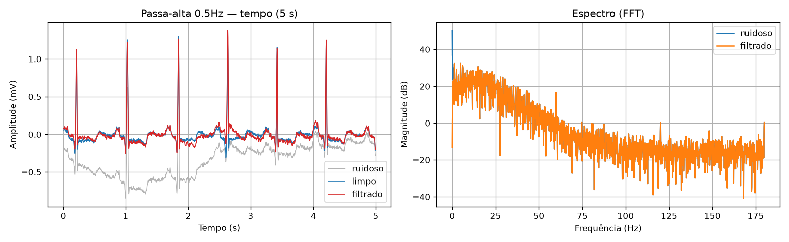

*Figura 4.4 — Remoção da deriva de linha de base: a oscilação lenta é eliminada e a linha de base fica estável.*

**Resultados.** O passa-alta entrega **Δ SNR ≈ +18,6 dB consistente** em todos os níveis de
entrada, com a correlação subindo de 0,975 a 1,000 conforme o ruído de entrada diminui — é o
filtro **certo** para *baseline wander*.

| SNR entrada (dB) | SNR saída (dB) | Δ SNR (dB) | PRD (%) | Corr. |
|---:|---:|---:|---:|---:|
| 0 | 12,85 | +18,64 | 22,77 | 0,975 |
| 6 | 18,85 | +18,64 | 11,41 | 0,994 |
| 12 | 24,85 | +18,64 | 5,72 | 0,998 |
| 18 | 30,85 | +18,64 | 2,87 | 1,000 |

## 4.3 Passa-baixa FIR Hamming de 40 Hz

Atenua o ruído muscular de alta frequência; a janela de Hamming oferece atenuação de lóbulo
lateral de $\approx -41$ dB. FIR de fase linear → atraso de grupo constante de 30 amostras;
avaliado em **fase-zero** (cuidado de protocolo nº 1).

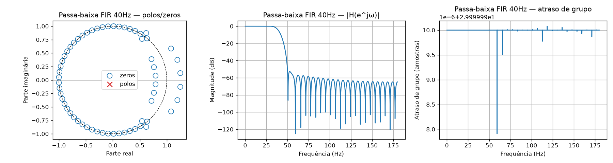

*Figura 4.5 — Formalização do FIR passa-baixa de 40 Hz: note a fase linear e o atraso de grupo constante.*

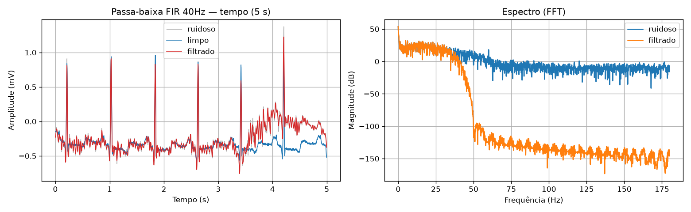

*Figura 4.6 — Contra ruído muscular de banda larga, a melhoria visível é pequena: o ruído ocupa a mesma faixa do ECG.*

**Resultados.** Contra ruído muscular (`ma`) e de eletrodo (`em`), de banda larga, o passa-baixa
de 40 Hz **praticamente não melhora o SNR (Δ ≈ 0 dB, chegando a levemente negativo)** — porque o
ruído ocupa a mesma faixa do ECG. A correlação melhora com o SNR de entrada, mas o ganho de
filtragem é nulo. **Esta é a limitação central dos filtros convencionais que motiva os filtros
avançados** (Parte II).

| Ruído | SNR entrada (dB) | SNR saída (dB) | Δ SNR (dB) | PRD (%) | Corr. |
|:--|---:|---:|---:|---:|---:|
| `ma` | 0 | 0,09 | +0,08 | 99,08 | 0,467 |
| `ma` | 6 | 6,02 | +0,03 | 49,99 | 0,722 |
| `ma` | 12 | 11,80 | −0,19 | 25,71 | 0,897 |
| `ma` | 18 | 17,01 | −0,98 | 14,11 | 0,966 |
| `em` | 0 | −0,01 | −0,00 | 100,14 | 0,462 |
| `em` | 6 | 5,93 | −0,06 | 50,52 | 0,719 |
| `em` | 12 | 11,71 | −0,28 | 25,97 | 0,895 |
| `em` | 18 | 16,94 | −1,05 | 14,23 | 0,965 |

## 4.4 Síntese da Parte I

| Ruído | Filtro adequado | Resultado típico |
|:--|:--|:--|
| 60 Hz (rede) | **Notch IIR** | SNR saída ≈ 34,6 dB · PRD 1,9 % · corr 0,999 |
| Deriva (`bw`) | **Passa-alta Butterworth** | Δ SNR ≈ +18,6 dB consistente · corr → 1,0 |
| Muscular (`ma`/`em`) | Passa-baixa FIR (insuficiente) | **Δ SNR ≈ 0 dB** — motiva os avançados |

---

# Parte II — Filtros Avançados (dados reais MIT-BIH)

Análise das três técnicas — **LMS**, **NLMS** e **DWT** — aplicadas a registros reais do MIT-BIH,
cada um contaminado com o ruído característico de cada caso, em janelas de 5 s (1800 amostras).
A referência de cada filtro adaptativo é escolhida conforme a natureza do ruído:

- **60 Hz:** referência senoidal sintética em 60 Hz (frequência conhecida — caso clássico de
  cancelamento de ruído com referência);
- **0,2 Hz:** referência senoidal em 0,2 Hz (frequência respiratória / *wander*);
- **Gaussiano/EMG:** sem frequência conhecida → usa-se uma *delay-line* do próprio sinal
  ($D = 5$ amostras), abordagem que só funciona bem quando o ruído tem correlação temporal.

*(As figuras desta parte são geradas em `notebooks/reais.ipynb` e consolidadas em
`notebooks/resultados.ipynb`.)*

## 5.1 Caso 1 — Ruído de 60 Hz (Registro 100)

**O ruído.** Interferência da rede elétrica (EMI), determinística e periódica. Como o QRS tem
componentes predominantemente abaixo de 40 Hz, a senoide de 60 Hz se sobrepõe ao sinal e pode
mascarar o segmento ST e dificultar a medição do intervalo QT. O registro 100 bruto já evidencia
um nível de ruído de alta frequência sobreposto à linha de base, visível como uma textura
"granulada" entre os complexos QRS.

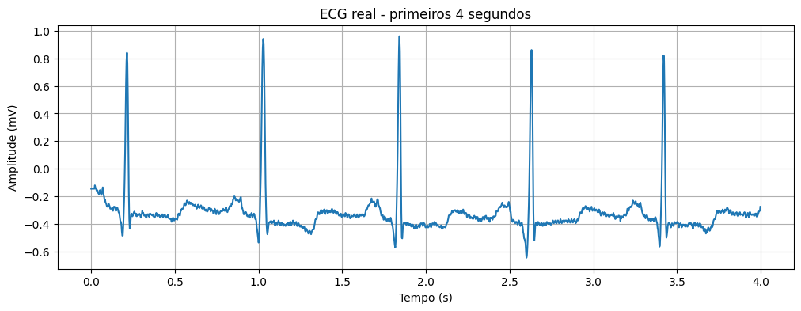

*Figura 5.1 — Sinal bruto do registro 100 (MIT-BIH): textura de ruído de alta frequência sobre a linha de base.*

**Domínio do tempo.** Os três métodos preservam bem a morfologia do QRS. LMS e NLMS ficam
praticamente sobrepostos ao original, com leve atenuação da textura de alta frequência; a DWT
produz a linha de base visivelmente mais suave.

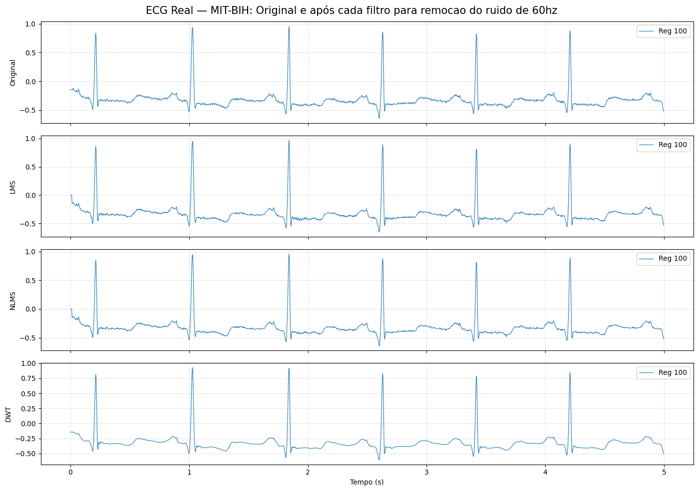

*Figura 5.2 — Registro 100 + ruído de 60 Hz: original e saída de cada filtro (LMS, NLMS, DWT).*

**Espectro (FFT).** A energia fisiológica concentra-se abaixo de ~40 Hz, com cauda de ruído além
de 120 Hz. A DWT é a que mais atenua a energia acima de 40–60 Hz.

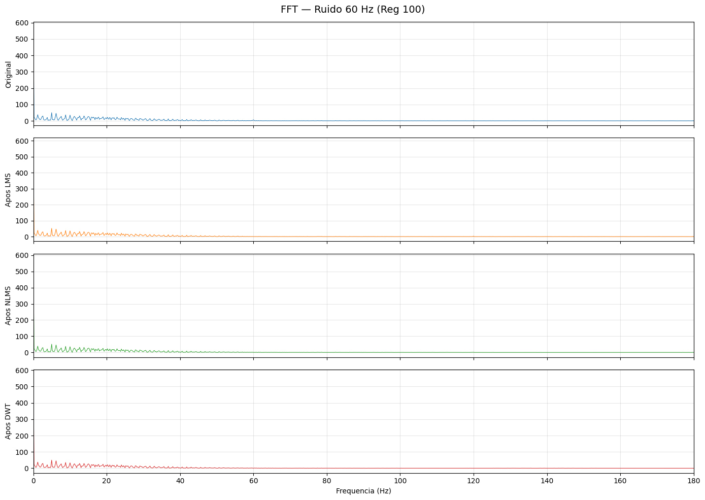

*Figura 5.3 — Espectro antes/depois da filtragem (caso 60 Hz).*

**Convergência dos pesos.** Os pesos de LMS e NLMS ($M = 5$) oscilam em torno de zero, estáveis;
picos transitórios coincidem com os instantes de QRS (o filtro reage ao QRS como "erro" a
corrigir). O NLMS oscila com menor amplitude, reflexo da normalização.

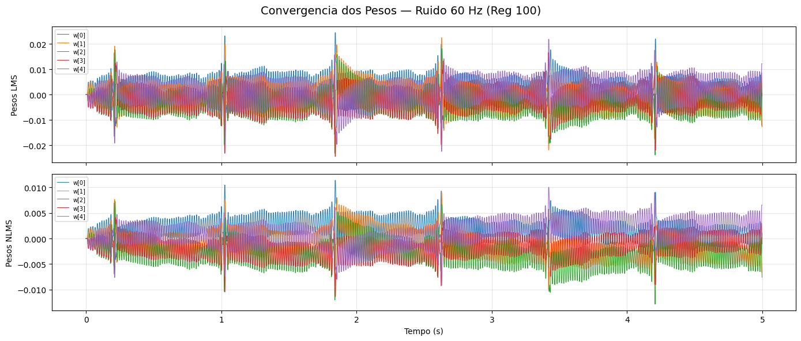

*Figura 5.4 — Evolução dos pesos adaptativos (LMS e NLMS) no caso de 60 Hz.*

**SNR.**

| Filtro | SNR (dB) |
|:--|---:|
| LMS | 28,1 |
| NLMS | **31,0** |
| DWT | 29,6 |

Desempenho elevado e comparável nos três, com o NLMS levemente superior — coerente com o caráter
quase periódico do ruído de rede.

## 5.2 Caso 2 — Deriva de Linha de Base / 0,2 Hz (Registro 101)

**O ruído.** *Baseline wander* de origem respiratória (~0,15–0,5 Hz), que desloca o ST e dificulta
a análise do intervalo PR e a detecção do pico R.

**Domínio do tempo.** Aqui a diferença entre métodos é gritante. O **LMS** "achata" agressivamente
a linha de base, mas **introduz distorções nas ondas T e *overshoot* negativo após o QRS** — ou
seja, remove conteúdo de baixa frequência que pertence ao próprio ECG. O **NLMS** é pior: amplifica
os picos R (de ~1,1 mV para até ~1,5 mV) e fica instável. A **DWT** é a única que preserva
fielmente as ondas T e P, mantendo a linha de base praticamente idêntica à original.

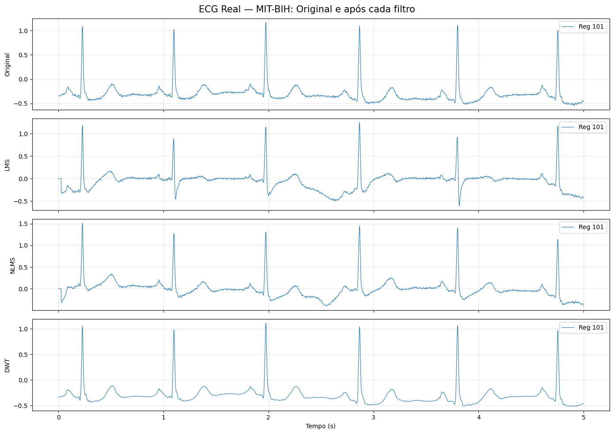

*Figura 5.5 — Registro 101 + deriva de 0,2 Hz: o NLMS amplifica os picos R (~1,5 mV) enquanto a DWT preserva a morfologia.*

**Espectro (FFT, 0–10 Hz).** Após LMS/NLMS o pico próximo de 0 Hz é reduzido, mas **surgem picos
espúrios** (~0,5/0,8/2,2 Hz) que não existiam — evidência espectral direta da distorção. O espectro
pós-DWT é quase indistinguível do original.

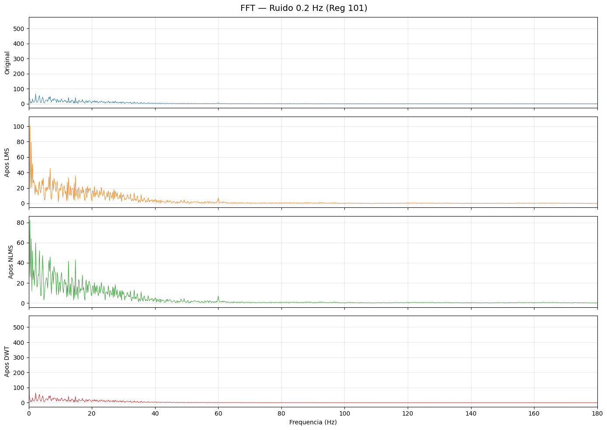

*Figura 5.6 — Espectro 0–10 Hz: picos espúrios surgem após LMS/NLMS; pós-DWT ≈ original.*

**Convergência dos pesos.** Os pesos do NLMS **divergem** a partir de $t \approx 2{,}5$ s
($w[0] > 1{,}0$, demais pesos negativos): padrão de instabilidade progressiva, não de convergência,
com os parâmetros usados ($\mu = 0{,}02$, $M = 10$).

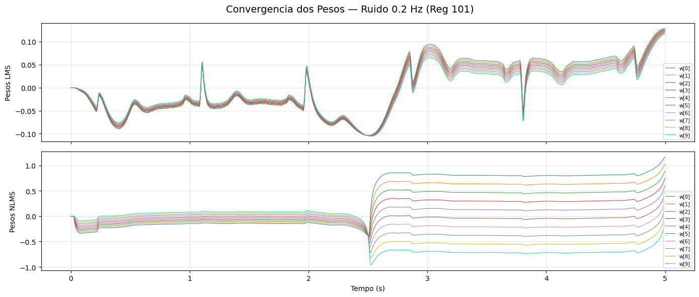

*Figura 5.7 — Divergência progressiva dos pesos do NLMS no caso de baixa frequência.*

**SNR.**

| Filtro | SNR (dB) |
|:--|---:|
| LMS | 1,9 |
| NLMS | 1,2 |
| DWT | **29,5** |

**Resultado mais marcante do estudo:** LMS e NLMS praticamente falham (SNR ≈ 0–2 dB — tanta
distorção quanto ruído removido), enquanto a DWT mantém desempenho excelente (29,5 dB) por atuar
sobre a decomposição multirresolução do próprio sinal, sem correlacionar conteúdo fisiológico de
baixa frequência com uma "referência de ruído".

## 5.3 Caso 3 — Ruído Aleatório / Gaussiano / EMG (Registro 103)

**O ruído.** Ruído branco gaussiano (modelo de EMG, ruído eletrônico e artefatos de movimento),
com energia distribuída em todas as frequências — **não há senoide de referência possível**.

**Domínio do tempo.** Com a referência *delay-line*, LMS e NLMS **amplificam fortemente os picos R**
(de ~1,8 mV para 2,0–2,2 mV) e introduzem oscilações maiores — em vez de suavizar, "espetam" o
sinal (o NLMS chega a picos negativos de −2,2 mV). A DWT preserva fielmente QRS, P e T, com leve
suavização da linha de base.

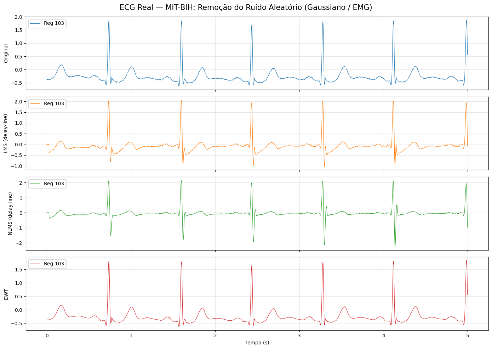

*Figura 5.8 — Registro 103 + ruído gaussiano: LMS/NLMS (delay-line) amplificam os picos R; a DWT preserva a forma de onda.*

**Convergência dos pesos.** Aqui os pesos **não oscilam em torno de zero**: $w[0]$ cresce de forma
quase monotônica (LMS até ~0,3; NLMS até ~0,45) — *drift* sem estabilização. O filtro está, na
prática, virando um **preditor linear** do ECG (aprende a prever a próxima amostra), não removendo
ruído gaussiano: sintoma de referência *delay-line* mal correlacionada com ruído verdadeiramente
aleatório.

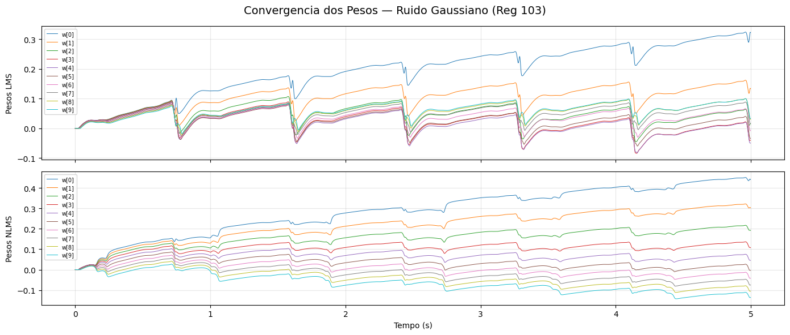

*Figura 5.9 — Deriva (drift) dos pesos com referência delay-line: o filtro vira um preditor linear, não um cancelador de ruído.*

**SNR.**

| Filtro | SNR (dB) |
|:--|---:|
| LMS | 4,6 |
| NLMS | 2,0 |
| DWT | **30,8** |

A DWT é amplamente superior (30,8 dB) — sem referência correlacionada, o cancelamento adaptativo
perde sua premissa fundamental.

## 5.4 Comparação geral dos avançados (SNR)

| Tipo de ruído | LMS (dB) | NLMS (dB) | DWT (dB) |
|:--|---:|---:|---:|
| 60 Hz | 28,1 | **31,0** | 29,6 |
| 0,2 Hz | 1,9 | 1,2 | **29,5** |
| Gaussiano | 4,6 | 2,0 | **30,8** |

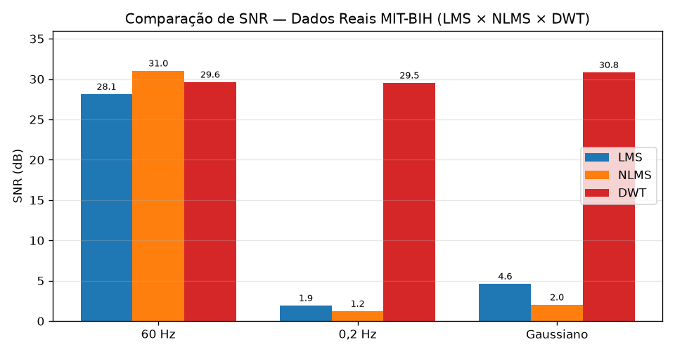

*Figura 5.10 — SNR por filtro e tipo de ruído (dados reais MIT-BIH): a DWT é a única consistente nos três cenários.*

Padrão central da Parte II:

- **A DWT é o único método consistentemente eficaz nos três cenários** (~29,5–30,8 dB),
  independentemente do tipo de ruído e **sem precisar de referência externa**.
- **LMS/NLMS só funcionam bem quando há uma referência fisicamente correlacionada e bem definida
  em frequência** (60 Hz). Com referência aproximada (0,2 Hz) ou substituta (*delay-line*), o
  desempenho cai para SNR ≲ 5 dB (sem ganho prático).
- **Entre LMS e NLMS não há vencedor consistente:** o NLMS supera no caso 60 Hz, mas é pior nos
  outros dois — a normalização pela energia amplifica o erro quando a referência não é informativa.

---

# Parte III — Técnica Inteligente: CNN-DAE

A terceira frente é a resposta direta à limitação central das Partes I e II: nenhum filtro
linear único trata bem **todas** as classes de ruído, e os mais simples (passa-baixa, adaptativo
sem referência) falham contra ruído de banda larga sobreposto ao ECG. A proposta é um *denoising
autoencoder* convolucional (CNN-DAE) — **um único modelo não linear, aprendido dos dados**, que
recebe uma janela de ECG ruidoso e devolve a janela limpa, qualquer que seja o tipo de ruído.

É um **subprojeto independente** (`cnn-dae/`), sem dependência do código das Partes I/II: tem o
próprio `data_io` (cobrindo os **48 registros** do `mitdb`, não apenas 5), o próprio módulo de
contaminação (5 tipos de ruído, SNR contínuo) e o próprio pipeline de dados. O treino é feito no
Google Colab (GPU T4) pelos notebooks `treino_cnn_dae.ipynb` / `validacao_cnn_dae.ipynb` /
`avaliacao_cnn_dae.ipynb`.

## 6.1 Arquitetura

Rede totalmente convolucional 1-D no formato **encoder → bottleneck → decoder**, com entrada e
saída de mesma forma `(1024, 1)` (janelas normalizadas por *z-score*). Os blocos do encoder são
`Conv1D → BatchNorm → ReLU`; os do bottleneck e do decoder são **blocos residuais**
($\text{saída} = F(x) + x$), que fazem a rede aprender apenas a *diferença* entre o ruidoso e o
limpo — isto é, o próprio ruído a remover.

| Estágio | Operação | Resolução (amostras) | Filtros | Kernel |
|:--|:--|:--:|:--:|:--:|
| Entrada | — | 1024 | 1 | — |
| Encoder E1 | Conv-BN-ReLU + MaxPool/2 | 1024 → 512 | 64 | 7 |
| Encoder E2 | Conv-BN-ReLU + MaxPool/2 | 512 → 256 | 128 | 5 |
| Encoder E3 | Conv-BN-ReLU + MaxPool/2 | 256 → 128 | 256 | 3 |
| Encoder E4 | Conv-BN-ReLU + MaxPool/2 | 128 → 64 | 256 | 3 |
| Bottleneck | 2 × bloco residual | 64 | 512 | 3 |
| Decoder D1 | UpSampling×2 + residual | 64 → 128 | 256 | 3 |
| Decoder D2 | UpSampling×2 + residual | 128 → 256 | 128 | 3 |
| Decoder D3 | UpSampling×2 + residual | 256 → 512 | 64 | 5 |
| Decoder D4 | UpSampling×2 + residual | 512 → 1024 | 32 | 7 |
| Saída | Conv1D 1×1 (linear) | 1024 | 1 | 1 |

Decisões de projeto e seus porquês:

- **Kernels grandes nas bordas, pequenos no centro.** Campo receptivo amplo (7/5) na resolução
  original capta morfologia do batimento; kernels menores (3) onde a resolução já é baixa.
- **Conexões residuais.** Como o sinal limpo é quase igual à entrada, aprender só a correção
  ($F(x)$) é mais fácil e estável, além de mitigar o gradiente desvanecente.
- **Saída linear.** O ECG tem valores negativos (onda Q, ST deprimido); ativação linear na última
  camada não os trunca.
- **Perda MAE, métrica MSE.** O MAE é robusto a *outliers* (batimentos ectópicos, artefatos);
  o MSE acompanha como proxy do SNR de reconstrução. Otimizador Adam, *learning rate* $10^{-3}$.

## 6.2 Protocolo de dados (a contribuição metodológica mais forte)

Aqui está o salto de rigor em relação às Partes I/II, que usavam poucos registros e janelas curtas:

- **Cobertura total:** todos os **48 registros** do MIT-BIH.
- **Separação por registro (sem vazamento):** **38 registros** (100–219) para treino+validação e
  **10 registros** (220–234) reservados para **teste — nunca vistos no treino**. Dentro de cada
  registro de treino, os 80 % iniciais vão para treino e os 20 % finais para validação (corte
  temporal). Há *asserts* no código garantindo a disjunção treino/teste.
- **Cinco tipos de ruído em um só modelo:** real do NSTDB (`bw`, `ma`, `em`) **+** rede elétrica
  sintética (`60hz`, `50hz`). O ruído real também é dividido temporalmente (80 % treino / 20 %
  teste), de modo que o modelo é testado em trechos de ruído inéditos.
- **SNR contínuo no treino:** cada janela é contaminada *on-the-fly* com um SNR sorteado
  uniformemente em **[−2, 20] dB**, tipo de ruído aleatório e fase/posição aleatórias — o modelo
  vê uma variedade praticamente infinita de condições, em vez de uma grade fixa.
- **SNR fixo no teste:** grade determinística **{0, 6, 12, 18} dB** (semente 2026), permitindo
  comparação direta com o protocolo das Partes I/II.
- **Janela de 1024 amostras** (≈ 2,84 s a 360 Hz), normalização *z-score* usando média/desvio do
  **sinal limpo** (a mesma transformação é aplicada ao par ruidoso/limpo, preservando a relação
  entre eles).

## 6.3 Treino

`model.fit` com até **150 épocas**, *batch* 32, 400 *steps*/época (≈ 12.800 janelas) e 100
*steps* de validação, alimentado por geradores `tf.data` que produzem pares contaminados
indefinidamente. Os *callbacks* tornam o treino auto-regulado:

- **ModelCheckpoint** — salva o melhor modelo por `val_loss` (`best_model.keras`);
- **EarlyStopping** — interrompe após 15 épocas sem melhora e restaura os melhores pesos;
- **ReduceLROnPlateau** — reduz o *learning rate* pela metade após 7 épocas de estagnação (até
  $10^{-6}$);
- **TensorBoard** — registro das curvas.

As curvas de aprendizado (MAE/MSE × época) e exemplos de filtragem são gerados ao final do
treino (`treino_cnn_dae.ipynb`, células 11–12).

## 6.4 Avaliação estatística

A força do subprojeto está na avaliação, bem mais rigorosa que a das partes anteriores. O
notebook `avaliacao_cnn_dae.ipynb` roda o modelo treinado sobre **toda a grade `ruído × SNR`**
dos 10 registros de teste e produz, **por janela**, o conjunto completo de métricas
(`src/metrics/metrics.py`): SNR de saída, Δ SNR, RMSE, PRD, correlação, além de MAE/MSE. Sobre
essa base por janela, calcula:

- **Estatística descritiva** por tipo de ruído e por SNR de entrada (média, mediana, desvio,
  quartis e percentis P05/P95) — não só a média, mas a *dispersão* do desempenho;
- **Taxa de falha** — percentual de janelas em que o modelo *piorou* o sinal (Δ SNR < 0), por
  condição;
- **Teste de Wilcoxon** (*signed-rank*) comparando a CNN-DAE com a **tabela de referência dos
  filtros convencionais** (`comparacao_convencionais.csv`), com *p-valor* e **tamanho de efeito**
  $r = Z/\sqrt{N}$ — o único confronto numérico direto entre as frentes;
- **Intervalos de confiança 95 % por *bootstrap*** (B = 1000 reamostragens) para PRD, correlação
  e Δ SNR médios de cada condição;
- **Análise de falha** — visualização das piores janelas (menor Δ SNR), para diagnosticar *em que
  morfologia* o modelo erra;
- **Boxplots** por ruído e por SNR, e exportação dos resultados (`resultados_por_janela.csv`,
  `wilcoxon_vs_baseline.csv`, `bootstrap_ic95.csv`).

> **Estado dos resultados quantitativos.** O repositório versiona a **arquitetura, o pipeline e
> todo o arcabouço de avaliação** da CNN-DAE, mas **não inclui um checkpoint treinado**
> (`best_model.keras`) nem as figuras/CSVs de saída — os notebooks estão sem células executadas.
> Os números finais de SNR/Δ SNR/PRD da CNN-DAE são obtidos ao executar
> `treino_cnn_dae.ipynb` (treino no Colab) seguido de `avaliacao_cnn_dae.ipynb`. Esta Parte III
> documenta, portanto, **o projeto e o protocolo de avaliação** da técnica inteligente; a
> consolidação numérica e a sua inserção nas tabelas comparativas da Seção 7 são o passo final
> imediato (ver Seção 8.2).

## 6.5 O que se espera da CNN-DAE (hipótese de trabalho)

Pela natureza do método — mapeamento não linear aprendido, treinado conjuntamente nas cinco
classes de ruído e em ampla faixa de SNR — a expectativa, a ser **confirmada pelos números** após
o treino, é:

- **Generalização única:** um só modelo cobrindo 60 Hz, deriva e EMG/gaussiano, sem troca de
  filtro nem referência externa — vantagem operacional clara sobre LMS/NLMS;
- **Ganho potencial no caso mais difícil (banda larga/EMG)**, justamente onde o passa-baixa
  convencional fica em Δ ≈ 0 dB e os adaptativos falham;
- **Custo:** exige treino (GPU), dados rotulados (pares limpo/ruidoso) e é menos interpretável que
  um notch ou um Butterworth — o *trade-off* esperado de uma abordagem de aprendizado.

A avaliação da Seção 6.4 foi desenhada exatamente para **testar** essas hipóteses (inclusive a
taxa de falha e o Wilcoxon contra o baseline), e não apenas para reportar uma média favorável.

---

## 7. Comparação geral do projeto (convencionais × avançados × inteligente)

Cruzando as três frentes, emerge uma divisão de trabalho clara por tipo de ruído:

| Ruído | Convencional | Avançado clássico | Inteligente (CNN-DAE) | Leitura |
|:--|:--|:--|:--|:--|
| **60 Hz** | Notch IIR — excelente (≈ 34,6 dB, corr 0,999) | LMS/NLMS/DWT — todos bons (28–31 dB) | coberto pelo modelo único (a confirmar) | Ruído de banda estreita: **qualquer abordagem específica resolve**; o notch fixo é o mais simples e robusto. |
| **Deriva (`bw`/0,2 Hz)** | Passa-alta — excelente (Δ ≈ +18,6 dB) | DWT — excelente (29,5 dB); LMS/NLMS falham (1–2 dB) | coberto pelo modelo único (a confirmar) | Baixa frequência separável: **passa-alta linear ou DWT**; adaptativos distorcem o ECG. |
| **Muscular / Gaussiano (`ma`/`em`/EMG)** | Passa-baixa FIR — **falha (Δ ≈ 0 dB)** | **DWT — excelente (30,8 dB)**; LMS/NLMS falham | alvo principal do modelo (a confirmar) | Ruído de banda larga sobreposto ao ECG: **DWT resolve; a CNN-DAE é a aposta de generalização** num só modelo. |
| **Todos juntos** | troca de filtro por ruído | troca de método por ruído | **um único modelo para os 5 tipos** | A CNN-DAE é a única abordagem **não especializada por ruído** — sua vantagem operacional. |

*(A coluna CNN-DAE registra o papel projetado; os números entram após o treino — ver Parte III, Seção 6.4.)*

**Conclusões transversais:**

1. **Para ruído de banda estreita e bem localizado (60 Hz),** o filtro mais simples já basta: o
   notch IIR convencional iguala ou supera os avançados, com custo computacional mínimo.
2. **Para a deriva de linha de base,** o passa-alta linear e a DWT são as escolhas seguras; os
   adaptativos LMS/NLMS, apesar de "atacarem" a baixa frequência, **distorcem a morfologia** (ondas
   T/P, *overshoot*) — risco inaceitável em contexto clínico.
3. **Para o ruído muscular/gaussiano de banda larga,** onde o passa-baixa convencional fracassa
   (Δ ≈ 0 dB), **a DWT é o salto de qualidade do projeto**, recuperando ~30 dB sem referência
   externa. Esse é exatamente o cenário que justifica investir nos filtros avançados.
4. **A escolha do sinal de referência é o fator mais determinante para LMS/NLMS.** Eles brilham
   quando a referência captura a física do ruído (60 Hz) e se tornam inúteis — ou nocivos — quando
   a referência é uma aproximação ou um substituto.
5. **A CNN-DAE muda o eixo do problema:** em vez de escolher *um filtro por ruído*, propõe **um
   modelo para todos**. Troca conhecimento de projeto (polos/zeros, limiar wavelet, referência) por
   dados rotulados e treino. Se os números confirmarem a hipótese da Seção 6.5, ela é a forma mais
   geral de *denoising* do projeto; o custo é treino, dados e menor interpretabilidade.

---

## 8. Conclusões e trabalhos futuros

### 8.1 Conclusões

- O projeto cumpriu o objetivo de **projetar, validar e comparar** filtros convencionais,
  avançados clássicos e uma técnica inteligente para as três classes de ruído do ECG, com
  **métricas objetivas** sobre dados reais do PhysioNet.
- **Não existe um único "melhor filtro" clássico:** a escolha ótima depende do ruído. Em ordem de
  recomendação prática: **60 Hz → notch IIR**; **deriva → passa-alta Butterworth ou DWT**;
  **EMG/banda larga → DWT**.
- A **DWT** foi o método mais **robusto e de uso mais simples** entre os avançados clássicos (não
  exige referência, mantém alta fidelidade morfológica nos três ruídos).
- Os filtros **adaptativos LMS/NLMS** introduziram distorções relevantes (*overshoot*,
  amplificação de picos R) nos casos de baixa frequência e ruído aleatório — um risco em aplicações
  clínicas, onde a integridade da forma de onda é crítica para o diagnóstico.
- Os **gráficos de convergência dos pesos** foram úteis para *diagnosticar* a falha: nos casos
  problemáticos os pesos não estabilizam (seguem *drift* ou reagem ao QRS), sintoma direto de
  referência mal correlacionada.
- A **técnica inteligente (CNN-DAE)** foi **projetada e implementada por completo** — arquitetura
  residual convolucional, protocolo de dados rigoroso (48 registros, *holdout* por registro, 5
  tipos de ruído, SNR contínuo) e um arcabouço de avaliação estatística (Wilcoxon vs. baseline,
  *bootstrap*, análise de falha) mais exigente que o das demais frentes. Falta apenas a execução
  do treino para consolidar os números (Seção 6.4) — é o único item pendente do projeto.

### 8.2 Possíveis melhorias futuras

- **Consolidar os resultados da CNN-DAE:** rodar `treino_cnn_dae.ipynb` no Colab, versionar o
  `best_model.keras`, executar `avaliacao_cnn_dae.ipynb` e inserir os números (SNR/Δ SNR/PRD,
  Wilcoxon, IC *bootstrap*) nas tabelas comparativas da Seção 7.
- **Referências mais realistas para o EMG/gaussiano** (ex.: canal de eletrodo de referência
  dedicado, em vez de *delay-line*).
- **Ajuste sistemático de $\mu$ e $M$** (grid search) para LMS/NLMS nos casos de 0,2 Hz e
  gaussiano, hoje herdados do caso de 60 Hz.
- **Unificar os protocolos das três frentes** (mesmos registros, mesma contaminação real do
  `nstdb`, mesmos SNRs alvo) para um confronto numérico estritamente *head-to-head* entre
  convencionais, avançados clássicos e CNN-DAE.
- **DWT no caso de 60 Hz com nível de decomposição maior**, já que a FFT pós-DWT ainda mostrou
  energia residual acima de 40 Hz.
- **Variações da CNN-DAE:** comparar perdas (MAE × MSE × Huber), profundidade do *bottleneck* e
  janelas mais longas; e treinar uma variante por tipo de ruído para medir o custo de
  generalização do modelo único.

---

## 9. Reprodutibilidade

```
src/                            # Partes I e II
  data_io.py            # download/leitura mitdb+nstdb (wfdb, 360 Hz) — 5 registros
  noise/contaminate.py  # contaminate(signal, noise_type, snr_db) — bw/ma/em/60hz
  filters/              # notch 60Hz, passa-alta 0.5Hz, passa-baixa FIR 40Hz
  metrics/metrics.py    # SNR/ΔSNR/RMSE/PRD/correlação
  viz/plots.py          # polos-zeros, |H(e^jω)|, atraso de grupo, FFT, overlay
notebooks/
  01_dados, 02_filtros_convencionais, 03_demo       # convencionais (+ demo interativa)
  filtros, sintetico, reais, resultados             # avançados clássicos (LMS/NLMS/DWT)
scripts/gerar_figuras.py   # gera figuras de formalização + comparacao_convencionais.csv
report/                    # fontes LaTeX (introdução + fundamentação)
figures/                   # figuras e tabela usadas neste relatório

cnn-dae/                        # Parte III (subprojeto independente)
  src/data_io.py          # 48 registros mitdb + nstdb
  src/noise/contaminate.py# 5 tipos de ruído, SNR contínuo
  src/models/dataset.py   # pools, splits sem vazamento, geradores, tabela de teste
  src/models/model.py     # arquitetura CNN-DAE + callbacks
  train.py                # treino por linha de comando
  notebooks/              # treino / validacao / avaliacao (Colab T4)
  checkpoints/            # best_model.keras (gerado pelo treino — não versionado)
```

```bash
# Partes I e II
python3.12 -m venv .venv && source .venv/bin/activate
pip install -r requirements.txt                                         # pandas>=2.2.2 fixado
python -c "from src.data_io import ensure_datasets; ensure_datasets()"   # baixa os dados
./.venv/bin/python scripts/gerar_figuras.py                              # reproduz Parte I
# Parte II: executar notebooks/resultados.ipynb (roda filtros+sintetico+reais)

# Parte III (CNN-DAE) — local
cd cnn-dae && pip install -r requirements.txt
python train.py                                                          # treina (CPU/GPU)
# ou, no Colab (T4): treino_cnn_dae.ipynb → validacao_cnn_dae.ipynb → avaliacao_cnn_dae.ipynb
```

## 10. Referências principais

- Rangayyan, R. M.; Krishnan, S. *Biomedical Signal Analysis*, 3ª ed., Wiley, 2024.
- Challis, R. E.; Kitney, R. I. *The design of digital filters for biomedical signal processing*
  (parts 1–3), J. Biomedical Engineering, 1982–1983.
- Widrow, B. et al. *Adaptive noise cancelling: principles and applications*, Proc. IEEE, 1975.
- Thakor, N. V.; Zhu, Y.-S. *Applications of adaptive filtering to ECG analysis*, IEEE TBME, 1991.
- Donoho, D. L. *De-noising by soft-thresholding*, IEEE Trans. Information Theory, 1995.
- Singh, B. N.; Tiwari, A. K. *Optimal selection of wavelet basis function applied to ECG signal
  denoising*, Digital Signal Processing, 2006.
- Chiang, H.-T. et al. *Noise reduction in ECG signals using fully convolutional denoising
  autoencoders*, IEEE Access, 2019.
- Moody, G. B.; Muldrow, W. E.; Mark, R. G. *A noise stress test for arrhythmia detectors*,
  Computers in Cardiology, 1984 (`nstdb`).
- Goldberger, A. L. et al. *PhysioBank, PhysioToolkit, and PhysioNet*, Circulation, 2000.

*(Bibliografia completa em `report/referencias.bib`.)*
